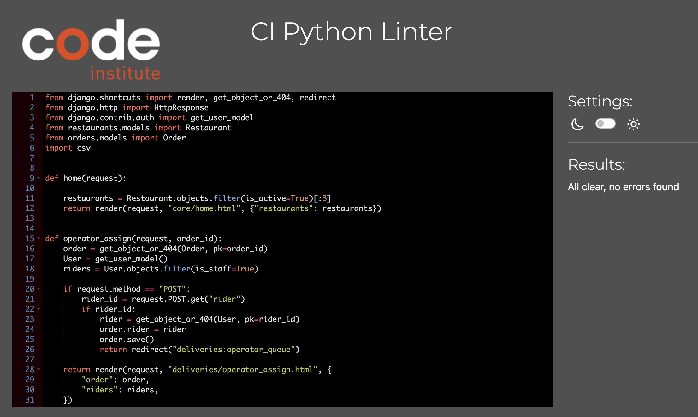

  

A full-stack Django web application for online food ordering and delivery management.  
Customers can browse restaurants, add dishes to their cart, and place orders.  
Restaurant owners manage menus and incoming orders.  
Operators assign deliveries to riders, who update delivery statuses.  

The deployed project live link is [HERE](https://foodhub-f53dab9dc3ee.herokuapp.com/)  

---

## 📌 Contents  

- [Introduction](#introduction)  
- [Project Goals](#project-goals)  
- [User Goals](#user-goals)  
- [Site Owner Goals](#site-owner-goals)  
- [Pre-Development Planning](#pre-development-planning)  
- [Development](#development)  
- [Features](#features)  
- [User Stories Implemented](#user-stories-implemented)  
- [Technologies Used](#technologies-used)  
- [Testing](#testing)  
- [Validation](#validation)  
- [Deployment](#deployment)  
- [Bugs](#bugs)  
- [Credits](#credits)  

---

## Introduction  

**FoodHub** is a food ordering and delivery platform inspired by services like JustEat.  
  

It allows different types of users (customers, restaurant owners, riders, and operators) to interact with the platform:  

- Customers can browse restaurants, place orders, and track deliveries in real time.  
- Restaurant owners manage menus and update the status of orders.  
- Riders are assigned to deliveries and update statuses (picked up → delivered).  
- Operators manage delivery assignments and monitor workflows.  

---

## Project Goals  

- Provide an intuitive platform for ordering food online.  
- Allow restaurant owners to manage their business digitally.  
- Streamline delivery logistics with clear rider assignments.  
- Notify customers of order progress with emails and tracking.  
- Ensure a responsive, mobile-friendly interface.  

---

## User Goals  

- Easily sign up and log in.  
- Browse restaurants and see menus with pictures, prices, and descriptions.  
- Add dishes to a cart, adjust quantities, and check out.  
- Receive confirmation messages and email updates on status changes.  
- Track orders and delivery progress in real time.  

---

## Site Owner Goals  

- Provide a professional, functional food ordering platform.  
- Ensure reliable status tracking (Created → Preparing → Ready → Delivered).  
- Support multiple roles with different permissions (owner, operator, rider, customer).  
- Offer a polished UI/UX with a modern design.  
- Deploy securely to production (Heroku + PostgreSQL + Cloudinary).  

---

## Pre-Development Planning  

- **Wireframes** designed for restaurants, orders, and rider views.  
- **User stories** defined (A1,A2,B1,B2,B3,C1, C2, D1, D3, E1, E2, UI/UX).  
- **Database models** created for Restaurants, Dishes, Orders, Deliveries.  
- **Flow diagrams** for order lifecycle (cart → checkout → status transitions).  

---

## Development  

- Django framework used for models, views, and templates.  
- Bootstrap 5 + custom CSS for responsive UI.  
- PostgreSQL database (Heroku).  
- Cloudinary for media storage (restaurant/dish images).  
- Crispy Forms for styled forms.  
- WhiteNoise for static file handling in production.  
- Automated tests with Django TestCase.  

---

## Features  

### 🛒 Customer  
- Browse restaurants and menus. 
  
- Add items to cart and checkout.  
  
- Track order + delivery in real time.  
  

### 🍴 Restaurant Owner  
- Create and edit restaurant profile. 
   
- Add dishes with photos, prices, descriptions.  
- Manage incoming orders and update statuses. 
   

### 🧑‍💼 Operator  
- Monitor overall delivery flow.  

### 🔔 Notifications  
- Flash messages after key actions (order placed, status updated).  
- Email notifications on order/delivery status changes.  

### 🎨 UI/UX Polish  
- Custom color palette  
 

(#A76545, #FFA55D
 #FFDF88, #ACC572). 
- Responsive navbar with logo. 
  
  
- Footer with info and social links.
  
- Cards for restaurants and dishes. 
   
- Empty state alerts with Bootstrap.  
- Pagination for lists.  

---

## User Stories Implemented  
- **A1**: User registration
- **A2**: Profile management
- **B1**: Restaurant profile
- **B2**: Dish CRUD
- **B3**: Public view
- **C1/C2**: Customers can place and track orders.  
- **D1**: Operator can assign riders.  
- **D3**: Customer can track delivery timeline.  
- **E1**: Notifications on status change (flash + email).  
- **E2**: Operator can export orders to CSV.  
- **UI/UX**: Navbar, footer, alerts, crispy forms, responsive layout.  

---

## Technologies Used  

- **Backend**: Python, Django  
- **Database**: PostgreSQL (Heroku)  
- **Frontend**: Bootstrap 5, Crispy Forms, Custom CSS  
- **Media**: Cloudinary  
- **Deployment**: Heroku + Gunicorn + WhiteNoise  
- **Version Control**: GitHub  

---

## Testing  
The portal has undergone extensive testing, and the results are available for review
[here - TESTING](https://github.com/Saretta1194/FoodHUB/blob/main/TESTING.md)
 

---

## Validation  

- **HTML/CSS** checked via W3C validators. 
  

- **Python code** checked via Flake8/CI Linter.
Below are some screenshots of automated Python tests (only a sample, as full coverage generated many test outputs):  

  
  
  
  
  
  

---

## Deployment - Heroku

The subsequent actions were carried out to facilitate the deployment of this page to Heroku from its corresponding GitHub repository:

### Create the Heroku App

- Log in to [Heroku](https://dashboard.heroku.com/apps) or create an account.
- On the main page click the button labeled "New" in the top right corner and from the drop-down menu select "Create New App".
- Enter a unique and meaningful app name.
- Next, select your region.
- Click on the Create App button.

### Attach the Postgres database

- In the Resources tab, under add-ons, type in Postgres and select the Heroku Postgres option.
- Copy the DATABASE_URL located in Config Vars in the Settings Tab.

### Prepare the environment and settings.py file

- In your workspace, create an env.py file in the main directory.
- Add the DATABASE_URL value and your chosen SECRET_KEY value to the env.py file.
- Update the settings.py file to import the env.py file and add the SECRETKEY and DATABASE_URL file paths.
- Comment out the default database configuration.
- Save files and make migrations.
- Add Cloudinary URL to env.py.
- Add the Cloudinary libraries to the list of installed apps.
- Add the STATIC files settings - the url, storage path, directory path, root path, media url, and default file storage path.
- Link the file to the templates directory in Heroku.
- Change the templates directory to TEMPLATES_DIR.
- Add Heroku to the ALLOWED_HOSTS list.

### Create files/directories

- Create requirements.txt file.
- Create three directories in the main directory; media, storage, and templates.
- Create a file named "Procfile" in the main directory and add the following: web: gunicorn project-name.wsgi.

### Update Heroku Config Vars

Add the following Config Vars in Heroku:

- SECRET_KEY = yoursecretkey
- CLOUDINARY_URL = yourcloudinaryurl
- PORT = 8000
- DISABLE_COLLECTSTATIC = 1

### Deploy

- NB: Ensure in Django settings, DEBUG is False
- Go to the deploy tab on Heroku and connect to GitHub, then to the required repository.
- Scroll to the bottom of the deploy page and either click Enable Automatic Deploys for automatic deploys or Deploy Branch to deploy manually. Manually deployed branches will need re-deploying each time the repo is updated.
- Click View to view the deployed site.

The site is now live and operational.
---

## Bugs  

- Fixed login redirect loop by configuring `LOGIN_URL`.  
- Adjusted navbar to display correct links per role (customer/owner/rider).  
- Fixed crispy forms rendering on signup/profile pages.  
- Fixed delivery status flow to block invalid transitions.  

---

## Credits  

- **Code Institute**: Django walkthrough project as base inspiration.  
- **Bootstrap**: Responsive design framework.  
- **Cloudinary Docs**: Media hosting integration.  
- **Heroku Docs**: Deployment setup.  
- **Slack community + mentor**: Guidance and debugging help.  
- FoodHub branding and design inspired by services like JustEat.  
- **Logo**: Created with the help of **Artificial Intelligence (AI)** design tools.  
- **YouTube Tutorials**: Various Django/Bootstrap deployment and feature implementation videos were used for guidance.  

---
## Frameworks - Libraries - Programs Used

- [Django](https://www.djangoproject.com/): Main python framework used in the development of this project
- [Django-allauth](https://django-allauth.readthedocs.io/en/latest/installation.html): authentication library used to create the user accounts
- [PostgreSQL](https://www.postgresql.org/) was used as the database for this project.
- [Heroku](https://dashboard.heroku.com/login) - was used as the cloud-based platform to deploy the site on.
- [AmIResponsive?](https://ui.dev/amiresponsive) - Used to verify the responsiveness of my website on different devices.
- [Chrome Dev Tools](https://developer.chrome.com/docs/devtools/) - Used for overall development and tweaking, including testing responsiveness and using lighthouse.
- [Font Awesome](https://fontawesome.com/) - Used for icons in the three-reasons section.
- [GitHub](https://github.com/) - Used for version control and agile tool.
- [Google Fonts](https://fonts.google.com/) - Used to import and alter fonts on the page.
- [W3C](https://www.w3.org/) - Used for HTML & CSS Validation.
- [CI Python Linter](https://pep8ci.herokuapp.com/) - used to validate all the Python code
- [Crispy Forms](https://django-crispy-forms.readthedocs.io/en/latest/) used to manage Django Forms
- [Cloudinary](https://cloudinary.com/): the image hosting service used to upload images
- [Bootstrap v5.3.2](https://getbootstrap.com/docs/5.3/getting-started/introduction/): CSS Framework for developing responsiveness and styling
- [Pexels](https://www.pexels.com/it-it/cerca/food%20delivery/):picture for all website

